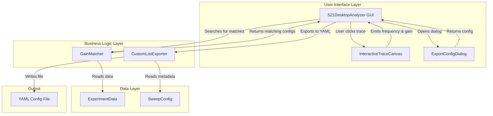
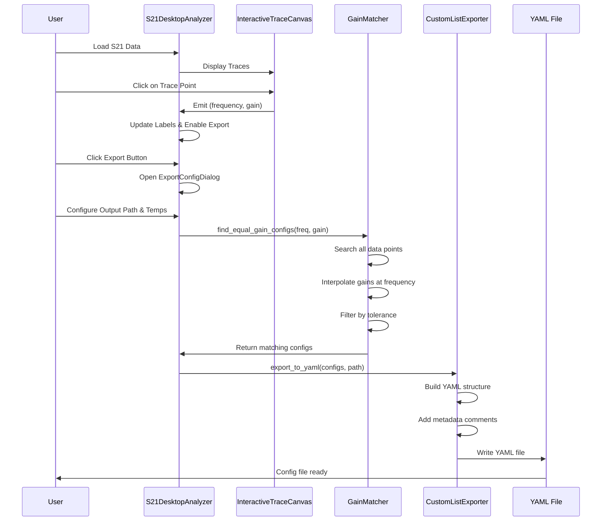
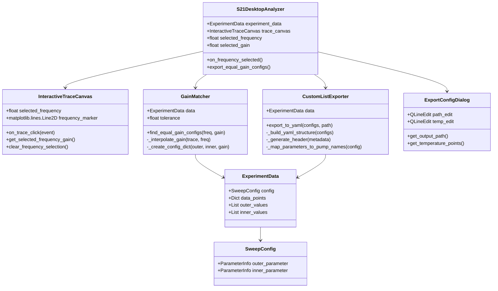

# Equal Gain Export Feature - Architecture Overview

## System Architecture



## Data Flow Sequence



## Class Relationships



## Component Responsibilities

### 1. InteractiveTraceCanvas
**Purpose**: Handle user interaction with trace plots

**Responsibilities**:
- Detect clicks on trace plots
- Calculate frequency from x-coordinate
- Interpolate gain value at clicked frequency
- Display visual marker at selected point
- Emit signal with frequency and gain data

**Key Methods**:
- `on_trace_click()`: Handle mouse click events
- `get_selected_frequency_gain()`: Return current selection
- `clear_frequency_selection()`: Remove selection marker

### 2. GainMatcher
**Purpose**: Search for pump configurations with matching gain

**Responsibilities**:
- Iterate through all data points in heatmap
- Interpolate S21 magnitude at target frequency
- Compare gains with tolerance threshold
- Sort results by proximity to target
- Map parameter values to configuration format

**Key Methods**:
- `find_equal_gain_configs()`: Main search algorithm
- `_interpolate_gain()`: Linear interpolation at frequency
- `_create_config_dict()`: Format output configuration

**Algorithm**:
```python
for each (outer_val, inner_val) in data_points:
    trace = get_trace(outer_val, inner_val)
    gain = interpolate(trace, target_frequency)
    
    if |gain - target_gain| <= tolerance:
        config = create_config(outer_val, inner_val, gain)
        matching_configs.append(config)

sort matching_configs by |gain - target_gain|
return matching_configs
```

### 3. CustomListExporter
**Purpose**: Generate YAML configuration files

**Responsibilities**:
- Build custom_list_mode YAML structure
- Map parameter values to pump names
- Add metadata comments
- Handle temperature sweep configuration
- Write formatted YAML file

**Key Methods**:
- `export_to_yaml()`: Main export function
- `_build_yaml_structure()`: Create YAML dict
- `_generate_header()`: Create comment header
- `_map_parameters_to_pump_names()`: Parameter mapping

**Output Format**:
```yaml
# Equal Gain Configuration Export
# Generated: 2026-01-23T12:00:00
# Target Frequency: 6.7500 GHz
# Target Gain: 15.20 dB
# Tolerance: ±0.50 dB
# Configurations Found: 8

sweep:
  mode: custom_list
  loop_order:
    - temperature
  axes:
    temperature: [0.2, 0.3, 0.4]
  custom_configs:
    - pump1_power: -3.0
      pump1_frequency: 8.42e9
      pump1_phase: 0
      # Gain: 15.18 dB @ 6.75 GHz
    - pump1_power: -2.5
      pump1_frequency: 8.40e9
      pump1_phase: 90
      # Gain: 15.22 dB @ 6.75 GHz
```

### 4. ExportConfigDialog
**Purpose**: Collect user input for export configuration

**Responsibilities**:
- Get output file path
- Parse temperature points
- Validate user input
- Provide file browser dialog

**Key Methods**:
- `get_output_path()`: Return selected file path
- `get_temperature_points()`: Parse temperature list
- `browse_output_path()`: Open file dialog

### 5. S21DesktopAnalyzer (Modified)
**Purpose**: Orchestrate the export workflow

**Responsibilities**:
- Receive frequency selection from canvas
- Update UI with selection info
- Coordinate between components
- Handle user interactions
- Display success/error messages

**New Methods**:
- `on_frequency_selected()`: Handle selection event
- `export_equal_gain_configs()`: Main export workflow

## Parameter Mapping Logic

The system needs to map heatmap coordinates to pump parameter names:

```python
# Example mapping for single TWPA:
outer_parameter = "pump1_power"  # From SweepConfig
inner_parameter = "pump1_frequency"  # From SweepConfig

# Heatmap point (outer_val=-3.0, inner_val=8.42e9) maps to:
config = {
    "pump1_power": -3.0,
    "pump1_frequency": 8.42e9,
    "pump1_phase": 0  # Default or from data
}

# Example mapping for cascaded TWPA:
outer_parameter = "pump1_power"
inner_parameter = "pump2_power"

# Heatmap point (outer_val=-3.0, inner_val=-8.0) maps to:
config = {
    "pump1_power": -3.0,
    "pump1_frequency": 8.42e9,  # From data or default
    "pump1_phase": 0,
    "pump2_power": -8.0,
    "pump2_frequency": 8.39e9,  # From data or default
    "pump2_phase": 90
}
```

## Error Handling Strategy

### User-Facing Errors:
1. **No frequency selected**: Show warning dialog
2. **No matching configs found**: Show info dialog with search parameters
3. **Invalid temperature input**: Use default values, show warning
4. **File write error**: Show error dialog with details

### Internal Errors:
1. **Interpolation failure**: Skip data point, log warning
2. **Missing parameter data**: Use defaults, log warning
3. **Invalid data format**: Show error, prevent export

## Integration Points

### With Existing Features:
- Uses existing `ExperimentData` structure
- Leverages existing `SweepConfig` metadata
- Compatible with both loader formats (RecordTrace, Cascade)
- Does not interfere with existing trace selection

### With twpa_noise_measurement:
- Output format matches `custom_list_mode` specification
- Parameter names match expected format
- Temperature sweep structure is compatible
- Comments are YAML-safe

## Performance Considerations

### Search Optimization:
- Linear search through all data points (acceptable for typical dataset sizes)
- Interpolation is O(log n) per trace (binary search in sorted frequency array)
- Total complexity: O(N * log M) where N = number of data points, M = trace length

### Memory Usage:
- No additional data copies needed
- Matching configs stored as lightweight dicts
- YAML generation is streaming (no large memory buffers)

### Typical Performance:
- Dataset: 40x40 heatmap = 1600 points
- Trace length: ~1000 frequency points
- Search time: < 1 second on modern hardware

## Testing Checklist

### Unit Tests:
- [ ] Gain interpolation accuracy
- [ ] Tolerance matching logic
- [ ] Parameter name mapping
- [ ] YAML structure generation
- [ ] Temperature parsing

### Integration Tests:
- [ ] End-to-end export workflow
- [ ] RecordTrace format compatibility
- [ ] Cascade format compatibility
- [ ] Single TWPA configuration
- [ ] Cascaded TWPA configuration

### UI Tests:
- [ ] Frequency selection visual feedback
- [ ] Export button enable/disable logic
- [ ] Dialog input validation
- [ ] Success/error message display

### Compatibility Tests:
- [ ] Generated YAML loads in twpa_noise_measurement
- [ ] Custom list mode executes correctly
- [ ] Parameter values are correctly interpreted